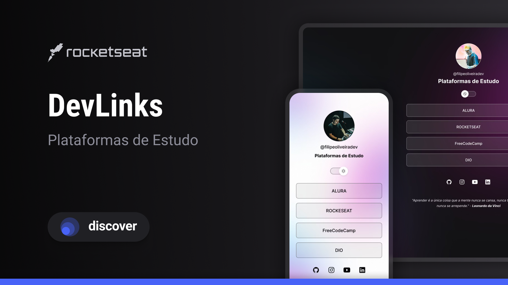

<h1 align="center"> DevLinks - Plataformas de Estudo </h1>

Programa exclusivo e gratuito, promovido pela Rocketseat para ensino de tecnologias WEB.  
<a href="https://www.rocketseat.com.br/discover?utm_source=google&utm_medium=cpc&utm_campaign=lead&utm_term=perpetuo&utm_content=institucional-lead-home-texto-lead-brandkws-none-none-institucional-none-none-br-google">Estude esse projeto em formato de vídeo clicando aqui.</a>

  <a href="#-projeto">Projeto</a>&nbsp;&nbsp;&nbsp;|&nbsp;&nbsp;&nbsp;
  <a href="#-tecnologias">Tecnologias</a>&nbsp;&nbsp;&nbsp;|&nbsp;&nbsp;&nbsp;
  <a href="#-layout">Layout</a>&nbsp;&nbsp;&nbsp;|&nbsp;&nbsp;&nbsp;
  <a href="#-licença">Licença</a>&nbsp;&nbsp;&nbsp;|&nbsp;&nbsp;&nbsp;
  <a href="#-desenvolvedor">Desenvolvedor</a>

  

## 💻 Projeto

O DevLinks é um agregador de links, que eu alterei e configurei para colocar o link das <b>Plataformas de Estudo</b> que estou participando no momento.

- [Acesse o projeto finalizado, online](https://filipeoliveira-dev.github.io/Plataformas-De-Estudo/)
- [Conheça os cursos da Rocketseat](https://app.rocketseat.com.br/cart/rocketseat-one?referral=filipe-oliveira-dev&coupon=indicamgm&utm_source=platform&utm_medium=organic&utm_campaign=venda&utm_term=mgm&utm_content=indication-lp_one)

## 🚀 Tecnologias

Esse projeto foi desenvolvido com as seguintes tecnologias:

- HTML e CSS
- JavaScript
- Git e Github
- Figma

## 🔖 Layout

Você pode visualizar o layout base do projeto da Rocketseat através [DESSE LINK](https://www.figma.com/community/file/1187422022288947321). (É necessário ter conta no [Figma](https://figma.com) para acessá-lo).

## 🔒 Licença

Esse projeto está sob a licença MIT.

  

## 👨🏻‍💻 Desenvolvedor:

<li> <b>E-mail:</b> <a href="mailto:filipe.osilvadev@gmail.com">Filipe.osilvadev@gmail.com</a>
<li> <b>LinkedIn:</b> <a href="https://www.linkedin.com/in/filipeoliveiradasilva/">Filipe Oliveira</a>
<li> <b>Estudos:</b> <a href="https://filipeoliveira-dev.github.io/Plataformas-De-Estudo/">Minhas Plataformas de Estudo</a>

    Sinta-se à vontade para explorar meus repositórios e entrar em contato! 😊

---

  <i>"Aprender é a única coisa que a mente nunca se cansa, nunca tem medo e nunca se arrepende." - <b>Leonardo da Vinci</b></i>

